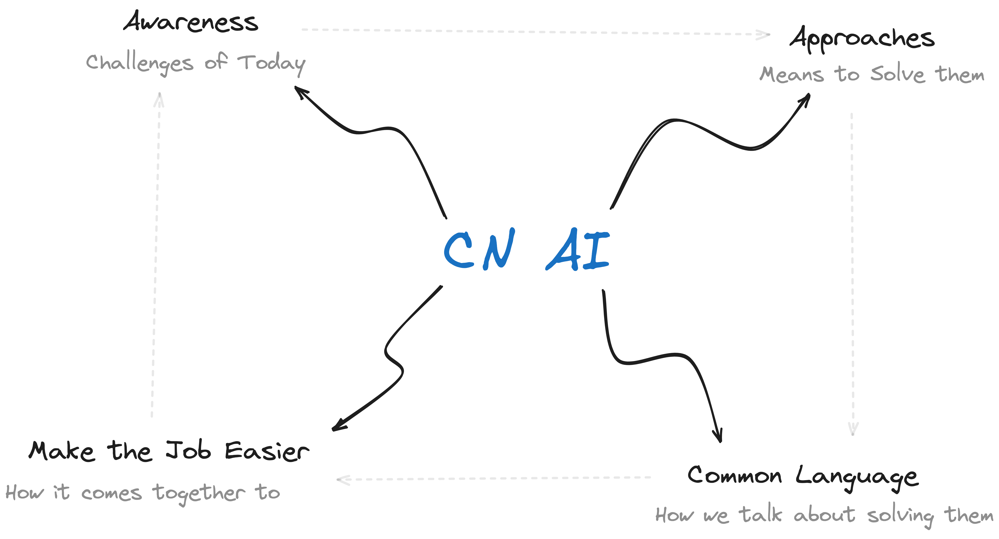
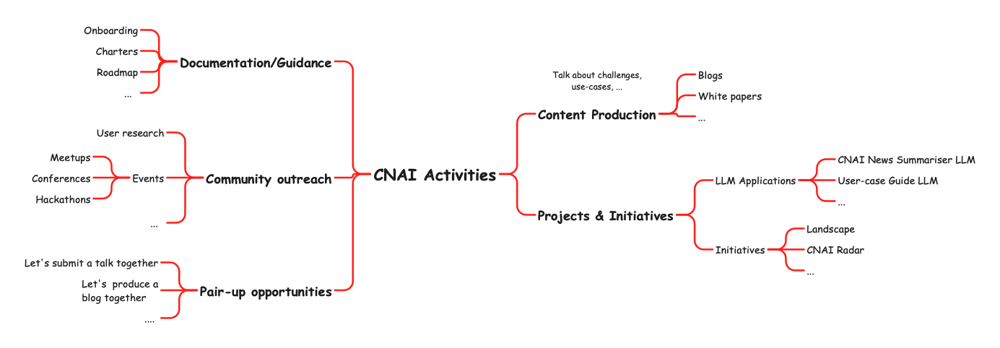

In recent years, the landscape of AI workloads has become more diverse, partly driven by the rapid advancement of Large Language Models and the proliferation of augmented retrieval use cases. This transformative landscape has prompted researchers and industry professionals to explore and develop approaches for effectively addressing the specific needs of these workloads.  However, adopting AI workloads is still hindered by the absence of a unified approach, best practices, shared knowledge, and suitable tools to get the job done, which remains an obstacle to adopting AI at scale.

## CNAI Mission

The group’s mission is to **streamline the integration of artificial intelligence within cloud native ecosystems, equipping the community with robust frameworks, tools, and best practices that not only ensure scalable, secure, and efficient AI deployments but also simplify bringing product-ready AI workloads to market**. We aim to make AI technologies accessible and comprehensible, empowering developers and organizations to innovate and enhance their capabilities within versatile cloud-native environments.

**Key Takeaway:** The group addresses the challenge of demystifying AI for a broader audience and ensuring that AI technologies can be effectively deployed, managed, scaled, and secured in cloud native architectures. Additionally, the group explores how AI can amplify and enhance the **user experience** for cloud native technologies.

## CNAI Deliverables

The CNAI WG will work to:

* **Produce detailed content** such as blogs, [white papers,](https://tag-runtime.cncf.io/whitepapers/cloudnativeai/) and user guides
* **Develop practical tools that simplify knowledge acquisition** and provide custom recommendations for Cloud-native AI deployments. 
* Enhance and foster **community collaboration and outreach** via Meetups, conferences, hackathons, and collecting feedback from the broader users and communities.
* **Foster collaboration within the community and marrying of the best ideas** to produce net new contributions.
* **Provide good documentation** for helping new joiners traveling from the same domain or distant domain find a place to contribute and collaborate (e.g., onboarding, charters, roadmaps,..).

These artifacts are intended for developers, IT professionals, and business stakeholders planning to deploy AI workloads at scale. The following sections provide more details.

**Key Takeaway**: The outcomes are designed to provide educational and practical resources that improve the implementation and understanding of AI, promote best practices, and showcase real-world use cases.

## Definition of Success

Success is defined by the **broad adoption of the working group's contributions and the establishment of self-sustaining practices** within the community. A more concrete definition will follow as the group evolves (and is able to measure things).

## Strategy & Deliverables

Towards our mission to streamline the integration of artificial intelligence within cloud-native ecosystems, we will be producing artifacts that fall into different categories:

### Content Production

As part of our mission to streamline AI integration within the cloud-native ecosystem. We will produce content that might take different forms such as white papers, blog posts, KubeCon talks, interviews, and more. The goal of the content produced is to:

* Highlight the benefits, challenges, and use cases of AI, making AI more accessible and understandable for a broader audience.
* showcase real-world examples of AI applications, providing valuable insights and practical advice.

Ideas for content to produce include answering some or more of the following questions:

* What is the impact of cloud-native AI on businesses?
* What is AI's impact on sustainability? How will we use cloud-native to build AI/ML applications responsibly?
* How to evolve the cloud native ecosystem, especially Kubernetes, to address issues around scheduling and batch workloads?
* How to improve inference speed?
* How to evaluate AI/ML applications?
* How to monitor, observe, and signal issues for AI/ML?
* …

### Projects & Initiatives

The artifacts that the group will produce is not constrained just to theoretical content. To showcase how CNAI can help, we will be producing AI applications ourselves to help the community foster (also as a form of eating our own cooking) and to continue our mission in streamlining AI with cloud-native.

Here are a few examples:

* [CNAI News Summarizer LLM](https://docs.google.com/document/d/1L-gP001biKswpLTX6X0iC2QfLZHBESPpa-VA3KfbhXU/edit): Create an AI-powered news summarizer that extracts the most important information from news articles, providing concise and informative summaries.
* [User-case Guide LLM](https://docs.google.com/document/d/11_6pvPzd956QONIxHuDP155eBRrd89xSC1tYVRy3KvI/edit#heading=h.z0eti03fxfmv): Develop an interactive user guide that utilizes LLM technology to provide personalized recommendations and guidance on how to apply AI to specific use cases.
* Showcasing how to deploy AI workloads on cloud-native?
* ....

In addition to hands-on and practical deliverables to the community, there will be initiatives to enhance accessibility to knowledge and provide further guidance. Here are a few examples

* CNAI [Landscape](https://rx-m.github.io/cnai-landscape/): projects out there
* CNAI Radar: Establish a comprehensive AI landscape that tracks the latest trends, technologies, and players in the AI field, enabling users to stay informed and competitive.

### Documentation/Guidance

To foster community growth and enhance our progress toward the group's mission, we aim to create comprehensive guiding materials. These materials will assist new members in understanding the group's goals and objectives and will highlight specific opportunities for them to contribute effectively.

* **[Onboarding](https://tag-runtime.cncf.io/wgs/cnaiwg/onboarding/)**: Develop a comprehensive onboarding guide that gives new members an overview of the CNAI Working Group, its goals, and how to get involved.
* **Mission/Charters (like this one)**: Create clear and concise charters for each sub-group within the CNAI Working Group, outlining their objectives, deliverables, and expected outcomes.
* **Roadmap**: Maintain and update a roadmap that outlines the short-term and long-term goals of the CNAI Working Group, ensuring alignment and transparency among members.

## Community Outreach & Feedback Gathering

To enhance the group's visibility and impact, we will actively promote the group’s achievements through multiple channels. Moreover, we will continuously gather feedback to refine and improve the group’s (positive) impact on the community.

* **User research:** Conduct regular user research to gather feedback and identify areas for improvement, ensuring that the CNAI Working Group remains responsive to its community's needs.
* **Events**: Organize and host meetups, conferences, and hackathons to foster collaboration, share knowledge, and build a strong community around AI.
* **Pair-up opportunities:** Surface opportunities for members to collaborate on projects, write blogs, or submit talks together, promoting teamwork and cross-pollination of ideas.

## Tracking our Work

We plan to track the group’s work using public channels such as Github, example: [https://github.com/orgs/cncf/projects/38](https://github.com/orgs/cncf/projects/38).  
 
For the short term, we will be using  to capture WIP, we will move to [https://github.com/orgs/cncf/projects/38](https://github.com/orgs/cncf/projects/38) once it’s correctly set up.

## FAQs

### How is CNAI different from other CNCF and AI-related WGs/Tags?  {#how-is-cnai-different-from-other-cncf-and-ai-related-wgs-tags}

The CNAI working group focuses on the interconnection between AI applications and cloud-native technologies. Unlike other working groups that may focus solely on solving specific technical problems in a specific context (e.g, serving/batch), CNAI explores broader integration challenges and opportunities to streamline AI workloads on top of the cloud-native ecosystem. This can range from **technical/functional** concerns (e.g., reference architecture, best practices, how-tos, etc.)  to **business and governance** concerns (e.g., ROI, responsible deployments, trust, etc). The artifacts produced are not necessarily APIs or inherently new projects. Instead, they focus on the interplay between existing projects, concepts, and APIs to solve existing use cases and business concerns.

Let’s take **_wg-batch_** as an example or **sig-batch** (Kubernetes specific). Technically, not all batch workloads are AI workloads. AI is a use case where batching makes sense, especially with training, for example. In that case, CNAI emphasizes the nuanced requirements of AI workloads in a cloud-native context. While both groups might explore scheduling, CNAI looks at how to tailor these solutions specifically for AI applications. For instance, AI model training, a typical batch workload, requires handling large volumes of data and intensive computation cycles efficiently CNAI would explore how existing cloud-native technologies and Kubernetes can be adapted or extended to meet these demands effectively, focusing on aspects like GPU allocation, network optimization, and persistent storage management tailored for AI, which go beyond general batch processing. Also, CNAI would touch on benefits/tradeoffs to provide best practices that will be especially useful for decision makers.

### What is the relationship between the [AI Alliance](https://thealliance.ai/) and CNAI?  {#what-is-the-relationship-between-the-ai-alliance-and-cnai}

The AI Alliance and Cloud Native AI (CNAI) operate with distinct but complementary missions within the AI ecosystem. The AI Alliance is focused on fostering **open innovation and collaboration across the AI technology landscape**, aiming to accelerate development and ensure **safety**, **security**, and **trust** in AI technologies. It emphasizes collaboration over standardization and engages in a broad range of activities from education to policy advocacy. 

On the other hand, CNAI concentrates on integrating AI into and for cloud-native environments and ecosystems, providing the tooling, **frameworks**, **reference architectures**, and **best practices** necessary for **effective, scalable, and secure AI deployments within these specific infrastructures**.

While the AI Alliance creates a broad collaborative network across multiple AI focus areas, CNAI targets the specific technical needs of deploying AI in/with/for cloud-native architectures and enhancing user experience for cloud native AI tooling, making their missions complementary in advancing the overall AI field.

### What is the relationship between the [OPEA](https://opea.dev/) and CNAI?  {#what-is-the-relationship-between-the-opea-and-cnai}

OPEA and CNAI are **complementary** in their objectives towards the AI landscape. OPEA offers a reference architecture and blueprints detailing the key building blocks for building LLM and Generative AI applications, prioritizing performance, feature completeness, trustworthiness, and enterprise grade readiness. CNAI on the other hand, could leverage OPEA’s frameworks and AI application architectures to provide an end to end guidance for deploying those generative AI architectures using cloud-native tooling and experience.

CNAI’s mission is rooted in enabling the integration of AI with and for the cloud native ecosystem to enable builders to produce best in class products and services using standardized tooling and shared knowledge. This involves making sure architectures such as the ones produced by OPEA can be effectively deployed and scaled using cloud native technologies. 

### What are other groups or SIGs that are related to this group (BFFs)?

* sig-apps
* [Batch-wg](https://groups.google.com/g/cncf-wg-bsi) (CNCF)
* [Wg-batch](https://docs.google.com/document/d/1XOeUN-K0aKmJJNq7H07r74n-mGgSFyiEDQ3ecwsGhec) (Kubernetes)
* [Wg-serving](https://github.com/kubernetes/community/pull/7823) (Kubernetes)
* [accelerator-management](https://github.com/kubernetes/community/pull/7805)(Kubernetes)